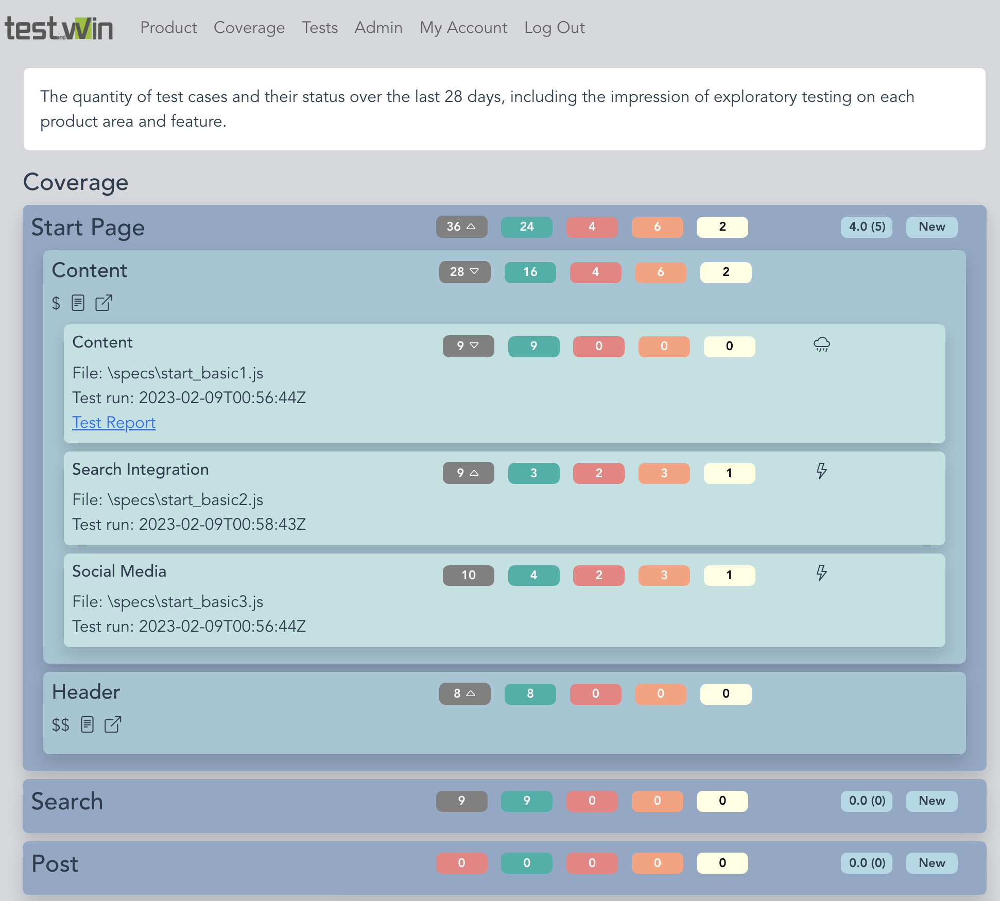

# e2e test coverage 

There are many good test reporting tools that can be used to get an overview of automated test runs.

But from my point of view, they lack an overview of which product area is covered with automated tests, incl. the respective test status. At least I have not found one.

**e2e test coverage** allows to define a product overview with the different areas with their features and to upload the test results.



In the automated tests, the same identifiers for the areas and features must then be used so that mapping can take place. The results of the automated tests can be uploaded via a REST endpoint. Currently, "only" Mocha reports are supported.

**e2e test coverage** considers test results of the last 28 days in the coverage view.

This is of course only a quantitative view and does not make any statement about the quality of the tests. But from my point of view it is still helpful to have such an overview.

Besides displaying the test coverage, **e2e test coverage** also allows collecting feedback from exploratory tests.

# Installation
* Clone the project and build the application. See [Build project](#Build-project) section below.

* **e2e test coverage** needs a MySQL database. The DB connection is configured in the ```db.env``` file. This file is stored in the same directory as the binary.

  Example:
  ```
  DB_USER = "root"
  DB_PASSWORD = "root"
  DB_HOST = "127.0.0.1:3306"
  DB_NAME   = "e2ecoverage"
  ```
* Run ```e2e-coverage```

  This starts **e2e test coverage** on port 8080. 

# Guide 
* Open **e2e test coverage** URL in the browser
* Select _Product_ and enter a product name. (The product name is not visible later.)
* Add areas and features to the product
* Adapt the test files of your test automation to have a title with this build-up: ```{area name}|{feature name}|{suite name}```, e.g. for Cypress Tests ```describe('{area name}|{feature name}|{suite name}', () => {```
* Upload the mocha report using the REST API endpoint (directly from the CI/CD pipeline)

  Example:
  ```curl -d @mocha-report1_1.json http://localhost:8080/api/v1/coverage/1/upload-mocha-report```
* Explore the _Coverage_ section
* Start logging exploratory tests by clicking on _Log new_

# Development
Please bear with me, this is my first Golang & Vue 3 project.

Project developed with 
* Golang 1.19
* Vue 3
* Bootstrap 5

## Folder Structure
* ```cmd/coverage``` Main Golang Application
* ```docs``` API Doc generated by Swag
* ```pkg/controller``` Implementation of API endpoints
* ```pkg/model``` Model of different structures
* ```pkg/reporter``` Files to import tests, currently only Mocha is implemented
* ```pkg/repository``` DB access
* ```pkg/router``` Route to the different endpoints
* ```ui``` Vue 3 application

## Build project

Go to ```ui``` and call ```npm install```

### Development
Call ```go run cmd/coverage/main.go``` to start the server, including UI. The Vue 3 app can also be started with ```npm run serve``` from the ```ui``` directory and is available on port 8081 (which I would recommend when working on the UI).

### Production
Call ```make build``` to create the binaries for the different operating systems. This call will also build the Vue 3 app and embeds this in the binary, as well as the Swagger doc. The binaries will be stored in the ```bin``` directory.
Maybe the compiler settings in ```Makefile``` must be adapted to your needs.

# Further Ideas
- [ ] Allow to re-order areas and features
- [ ] Create area + feature automatically when uploading reports
- [ ] Allow to add bugs in production (Ticket Number, Short Desc, severity). Or better: get this automatically
- [ ] Allow to use more than one product / maintain products
- [ ] Security
- [ ] Login
- [ ] Include SLA data, e.g. from Datadog